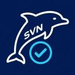
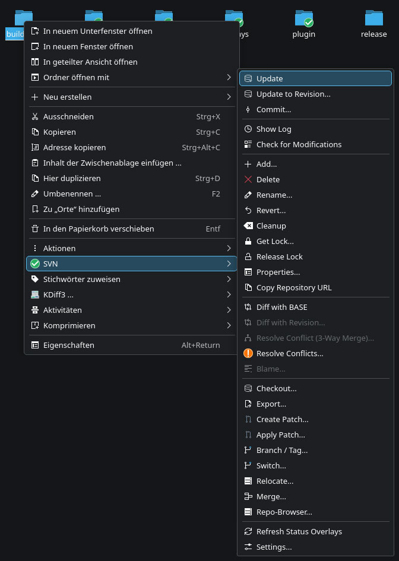

# Dolphin SVN Plugin

Subversion integration for the KDE Dolphin file manager, in the style of TortoiseSVN.

<p align="center">
  
</p>

The plugin adds Subversion actions to the Dolphin context menu and shows the working copy state directly on the file and folder icons. It targets Linux with KDE Plasma 6 and Qt 6.

```
right-click a working copy  →  SVN submenu  →  commit, update, log, diff, merge, ...
```

---

## Screenshots

The SVN submenu in Dolphin, with status overlay icons on the folders and the full set of actions in the submenu:

<p align="center">
  
</p>

---

## Features

| Area | Description |
|---|---|
| Status overlays | Icon overlays on files and folders show normal, modified, added, conflicted, unversioned and further states, with a short-lived cache and manual refresh |
| Everyday actions | Update, commit, revert, add, delete, rename and move, cleanup, lock and unlock |
| History | Log dialog with three panes, stop on copy, include merged revisions and affected paths, plus diff, blame and revert from the log |
| Differences | Diff against BASE, against a chosen revision and between two revisions, shown through an external diff tool |
| Branching | Branch and tag through a server-side copy, switch and relocate |
| Merging | Range merge and tree merge with the common options, merge tracking and a pick dialog for eligible revisions |
| Conflicts | Text and tree conflict resolution, with an optional three-way merge through an external tool |
| Patches | Create a patch from the selected changes and apply a patch with a dry-run preview and a reverse option |
| Repository browser | Browse a repository URL, check out, export, copy, move and edit properties |
| Properties | Read and set Subversion properties, including a helper to add entries to the ignore list |

The plugin runs the `svn` command line client. It contacts a repository only for the actions that require it, such as update, commit, log and merge.

---

## Requirements

- KDE Plasma 6 with Dolphin
- Qt 6 base libraries
- KDE Frameworks 6 (CoreAddons, KIO, I18n, Notifications)
- The Subversion command line client (`svn`)

An external diff and merge tool is optional. The plugin works well with [AnGscheidrDiffer](https://github.com/form1c/AnGscheidrDiffer) for side-by-side diffs, folder comparison and three-way merges.

---

## Installation

A prebuilt package is attached to each release on the [Releases page](https://github.com/form1c/Dolphin-SVN-Plugin/releases). Download the `.deb` and install it with `sudo apt install ./<file>.deb`, then restart Dolphin. The package is built for the Debian or Kubuntu release it was produced on; on a different distribution, build from source as shown below.

Build dependencies on Debian or Kubuntu:

```bash
sudo apt install cmake g++ gettext extra-cmake-modules \
    qt6-base-dev \
    libkf6coreaddons-dev libkf6kio-dev libkf6i18n-dev libkf6notifications-dev \
    subversion
```

Build and install a Debian package:

```bash
./scripts/build-deb.sh
sudo apt install ./release/dolphin-svn-plugin_1.0.0_amd64.deb
```

Restart Dolphin to load the plugin:

```bash
pkill dolphin; dolphin &
```

The build and the development install are described in [doc/installation.md](doc/installation.md).

---

## Usage

Right-click a file or a folder inside a working copy. The SVN submenu holds the actions that apply to the selection. Right-click a folder that is not a working copy to reach checkout, export, repository browser and the option to create a repository.

Icon overlays update on their own. Use the Refresh Status Overlays entry to force an update after an external change.

The actions and the overlays are described in [doc/usage.md](doc/usage.md).

---

## Building from source

```bash
cmake -S . -B build
cmake --build build -j$(nproc)
```

The result is two plugins under `build/bin/kf6`. See [doc/installation.md](doc/installation.md) for the development install that copies them into place, and [doc/development.md](doc/development.md) for the backend test suite.

---

## License

Released under the MIT License. See [LICENSE](LICENSE).

Built with [Qt](https://www.qt.io/) and the [KDE Frameworks](https://develop.kde.org/products/frameworks/), which are used under the LGPL. It drives the [Subversion](https://subversion.apache.org/) command line client.
